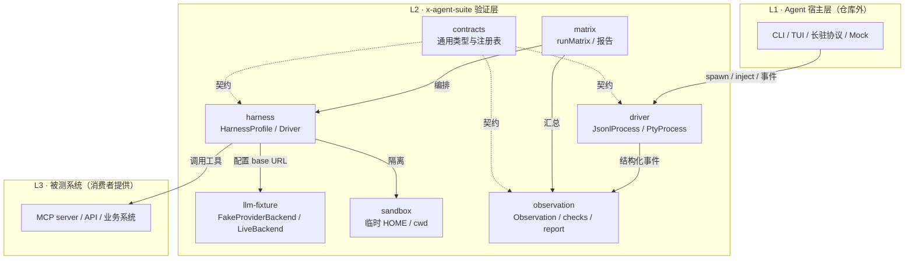
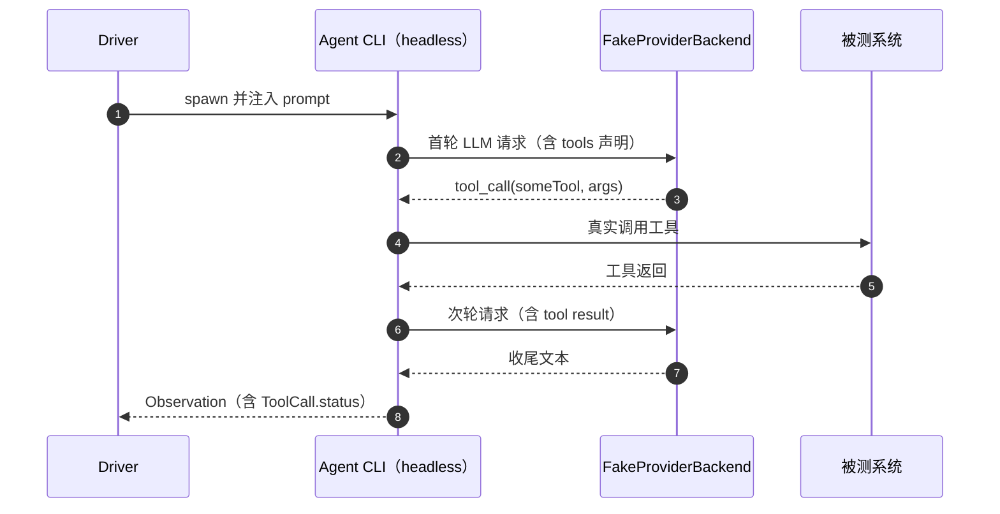
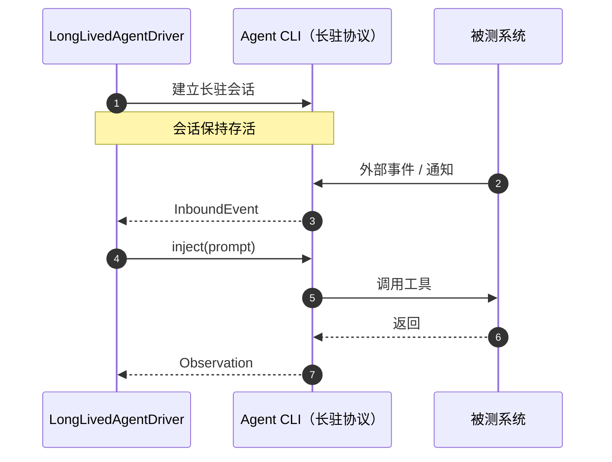

# 架构总览

x-agent-suite 处于「被测 Agent 宿主」与「被测系统」之间：它不认识任何具体被测系统，只提供观测、驱动、评分、报告四类基础设施。

## 语义分层

## 消息流示例

### 一次性 headless 宿主：出站

### 长驻宿主：多轮注入与入站事件

## 核心纪律

- **套件不认识任何被测系统**：具体工具名、协议、环境变量由消费者注册。
- **断言不刮 stdout**：统一消费 `Observation`，屏幕文本仅用于 PTY 同步。
- **状态证据独立**：`ArtifactEvidence`（或消费者自定义证据）与宿主输出分开评分。
