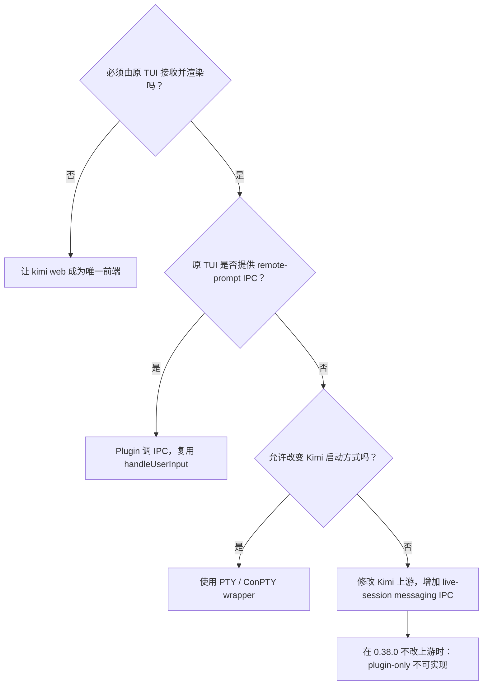

# Kimi Code 适配笔记

> 日期：2026-08-26
> 状态：已完成；结论适用于 Kimi Code CLI `0.38.0`
> 上游基线：`MoonshotAI/kimi-code` tag `@moonshot-ai/kimi-code@0.38.0`，commit `0999454bdcb5ddd98f39bffee434dcf0a810f394`

本文是 x-agent-suite 在 Kimi Code 上踩坑的汇总，包含三部分：

1. **TUI 空闲点火边界**：外部消息能否唤醒一个已运行且空闲的 Kimi 交互 TUI；
2. **双 TUI PTY 互通测试设计**：如何用 PTY + sandbox 验证两个真实 Kimi 终端经同一 broker 互发消息；
3. **HarnessProfile 配置要点**：fake provider、MCP 配置、插件安装、提交时序等实测细节。

---

## 一、TUI 空闲点火边界

### 1.1 需求必须分三层

“消息推给 Kimi 后，Kimi 应该收到”至少包含三层可观察语义：

1. **L1：durable delivery**
   - 消息到达 broker/daemon；
   - 消息追加进 durable inbox；
   - 发送方得到回执。
2. **L2：model turn ignition**
   - 某个 Kimi 执行器读取该消息；
   - 消息进入模型上下文；
   - 模型 turn 启动并完成。
3. **L3：live frontend ownership**
   - 执行 L2 的必须是用户正在看的原交互 TUI 进程；
   - 原 TUI 的 transcript、busy/idle、审批、问题面板同步更新；
   - 不得由隐藏的第二 Kimi 进程“替它”消费消息。

本次结论：**Kimi Code 0.38.0 没有可附着到已运行 TUI 的 remote-prompt / messaging IPC；在严格的 L3 语义下，plugin-only 方案不可实现。**

> `kimi web` 可以恢复相同的持久 session，并通过 REST 启动一个模型 turn；但该 turn 运行在另一个进程、另一套内存 Session 和事件总线上。它不等于唤醒原 TUI。

### 1.2 路径速览

| 路径                            | 能否落 durable inbox |        能否启动模型 turn | 是否原 TUI 执行并渲染 | 结论                                     |
| ------------------------------- | -------------------: | -----------------------: | --------------------: | ---------------------------------------- |
| Kimi MCP notification           |                   是 |                       否 |                    否 | 只到控制面，不点火                       |
| `UserPromptSubmit` hook         |                   是 |   仅在已有 prompt 提交时 |                    是 | 能注入，不能空闲点火                     |
| `Stop` hook deny                |                   是 | 仅在活跃 turn 结束时续轮 |                    是 | 能续轮，不能从空闲启动                   |
| `SessionHeartbeat` hook         |                   是 |                       否 |                    否 | fire-and-forget，不消费返回值点火        |
| `kimi --session … -p …`         |                   是 |                       是 |                    否 | 新进程                                   |
| `kimi acp`                      |                   是 |                       是 |                    否 | 独立 ACP 进程及其 Session map            |
| `kimi web` REST                 |                   是 |                       是 |                **否** | 独立 kap-server App scope；detached turn |
| 原 TUI 内部 `handleUserInput()` |                   是 |                       是 |                **是** | 正确入口，但 0.38.0 没有外部 IPC 暴露它  |
| PTY wrapper 注入键盘            |                   是 |                       是 |                    是 | 可做，但改变启动方式，不再是 plugin-only |
| 修改 Kimi 上游增加本地 IPC      |                   是 |                       是 |                    是 | 正确长期方案                             |

### 1.3 上游源码证明：原 TUI 的 prompt 入口只存在于进程内

Kimi TUI 安装 editor keyboard controller 时，把提交回调直接绑定到当前 `KimiTUI` 对象：

```ts
editor.onSubmit = (text: string) => {
  host.handleUserInput(text);
};
```

来源：[`apps/kimi-code/src/tui/controllers/editor-keyboard.ts`](https://github.com/MoonshotAI/kimi-code/blob/0999454bdcb5ddd98f39bffee434dcf0a810f394/apps/kimi-code/src/tui/controllers/editor-keyboard.ts#L99-L101)。

`KimiTUI.handleUserInput()` 负责空输入、replay、bash、busy queue 和 slash command 分流；普通文本最终进入 `sendNormalUserInput()`。这个入口是实例方法，没有 socket、HTTP 或进程间注册表。

普通消息的最终进程内调用链：

```text
CustomEditor.onSubmit
  -> KimiTUI.handleUserInput(text)
  -> slashCommands.dispatchInput(...)
  -> KimiTUI.sendNormalUserInput(text)
  -> KimiTUI.sendMessage(...)
  -> KimiTUI.sendMessageInternal(...)
  -> Session.prompt(...)
```

`sendMessageInternal()` 不只是调用模型；它还在**当前 TUI 实例**里 append transcript、更新 waiting/streaming phase、绑定媒体 staging lease、选择 prompt/steer、注册错误回收、依赖当前实例订阅的 turn event 更新 UI。

来源：[`KimiTUI.sendMessageInternal()`](https://github.com/MoonshotAI/kimi-code/blob/0999454bdcb5ddd98f39bffee434dcf0a810f394/apps/kimi-code/src/tui/kimi-tui.ts#L1741-L1825)。

要满足 L3，外部消息最终必须回到**这个对象、这个事件循环**里调用 `handleUserInput()`。只向磁盘写 session、只调用另一个进程的 `Session.prompt()`，都绕过了该链。

### 1.4 为什么 hooks 不能完成空闲点火

- **`UserPromptSubmit`** 挂在 `IAgentPromptService.onBeforeSubmitPrompt`：只有 prompt 已经被提交后，hook 才参与构建或否决。它能把 durable inbox 内容注入模型上下文，但不能自行创造最初的 prompt。
- **`Stop`** 只能延长一个已经存在的 turn：Stop hook 的 deny 逻辑位于 loop 的 `onDidFinishStep`。当 Stop 返回 reason 时，Kimi 会追加一个 `origin.kind = "system_trigger", name = "stop_hook"` 的 user message，并 enqueue continuation step。空闲时没有 `onDidFinishStep` 可触发。
- **`SessionHeartbeat`** 明确是观察型 fire-and-forget：官方文档定义它每 60 秒触发，返回空字符串，payload 的 `uptime_ms` 仅供观察。源码调用的是 `runner.fireAndForgetTrigger()`，结果没有进入 prompt service，也没有 enqueue turn。

### 1.5 为什么 `kimi web` 探针会产生“看起来成功”的误判

`kimi web` 的 kap-server 暴露 `POST /api/v1/sessions/{session_id}/prompts`，确实能：

- 列出由 TUI 创建并持久化的 session；
- POST prompt 后执行 `UserPromptSubmit` hook；
- hook pull/render/ack，cursor 推进；
- turn 产生 `turn.started`、tool call、`turn.ended`；
- 原 TUI 进程仍存活、仍可继续手工输入。

这些只能证明 web 执行器完成了 L2。关键区别：

```text
原 TUI 进程：App scope A / Session A / Event bus A / renderer A
kimi web 进程：App scope B / Session B / Event bus B / WS broadcaster B
```

`kimi web` 启动 kap-server 时会调用 `bootstrap(...)` 创建自己的 app/core scope；node SDK v2 的 client 构造同样会在**当前进程**调用 `bootstrap()`。共享的是 session ID、workspace 和持久化 journal；不共享的是活 Session 对象、事件总线、prompt queue、busy 状态和 TUI renderer。

所以 web 的 `turn.started` 只发到 B 的 event bus；原 TUI 只订阅 A，无法实时看到 B 的 turn。

### 1.6 真正可行的方案



**推荐：Kimi 上游提供 live-session messaging IPC**

最干净方案是在 `KimiTUI` 进程内加入受保护的本地控制面，例如 Unix socket `$KIMI_CODE_HOME/runtime/tui-<generation>.sock` 或 Windows named pipe `\\.\pipe\kimi-code-<generation>`。TUI 收到后必须在自己的事件循环调用 `this.handleUserInput(text)`，这样才能复用 slash command、idle/busy gate、queued messages、`sendMessageInternal()`、`Session.prompt()` / `Session.steer()`、transcript、event handler、renderer 和 approval/question UI。

**必需不变量**：

- endpoint 仅本机可达，权限限制为当前用户；
- token 不进日志、不进 session metadata、不暴露给模型；
- PID + generation 防 stale endpoint 与 PID reuse；
- 同一 live TUI 单 owner；replacement 原子抢占；
- busy 时明确 queue/steer/reject，不静默并发；
- receipt 区分 accepted、queued、started、completed；
- TUI stop 时删除 descriptor 并关闭 socket。

**可立即做但改变启动方式：PTY wrapper**

wrapper 创建 PTY/ConPTY，以 child 运行原版 `kimi`，双向转发终端 I/O，保存 PTY master，收到 ignition 时向同一 PTY 注入 prompt + Enter。输入最终经过原 editor `onSubmit`，所以由原 TUI 执行并渲染。

代价：不再是 plugin-only；所有会话必须从 wrapper 启动；要处理 bracketed paste、全屏 TUI、用户半输入、busy queue、Ctrl-C、resize、Linux/macOS PTY、Windows ConPTY 以及 wrapper crash 的终端恢复。

**使用 `kimi web` 作为唯一前端**

若产品明确要求用户从一开始就使用 `kimi web`，而不是同时保留一个独立 TUI，那么 REST prompt 是合法入口：web server 本身就是 live owner，浏览器通过它的 WS 订阅同一 event bus。限制是“唯一 owner”。

**保持 next-boundary 交接**

在不改上游、不加 wrapper 的前提下，唯一正确且诚实的 plugin-only 语义仍是：

- 活跃 turn：在 Stop 边界自动注入；
- 空闲 TUI：durable inbox 保留，等下一次人工 `UserPromptSubmit`；
- presence 可以显示“在线但不可空闲唤醒”；
- 文档不得承诺即时 IM 式到达。

### 1.7 最终裁定

对 Kimi Code CLI 0.38.0：

- 消息路由和 durable delivery 可可靠完成；
- `UserPromptSubmit` / `Stop` 边界可可靠交接消息；
- plugin 无法主动调用原 TUI 内部的 `handleUserInput()`；
- `kimi web`、headless prompt 和 ACP 都是独立执行器，不能当作原 TUI 点火；
- 因而“别人向空闲 Kimi TUI 推送后，原 TUI 无人工输入立即收到、启动模型并显示处理”在 **plugin-only + upstream 0.38.0 不改动** 的约束下不可实现。

正式可行方向只有三个：

1. 上游增加 live TUI messaging IPC（推荐）；
2. 用户通过 PTY wrapper 启动 Kimi；
3. 把 `kimi web` 变成唯一前端，而不是 TUI companion。

---

## 二、双 TUI PTY 互通测试设计

### 2.1 目标

用 x-agent-suite 的真实 PTY 驱动和隔离 sandbox，启动两个真实 Kimi Code TUI。两端只加载某个插件，经同一个共享 broker 完成 Alice → Bob 与 Bob → Alice 的发送、持久接收、下一轮注入和 ack。

验收必须证明插件自己的 MCP、hook、bridge daemon、inbox 与 broker client 全部参与；不得由测试 reference MCP、固定假 handle 或屏幕文本假阳性旁路。

### 2.2 设计原则

1. **plugin-only**：Kimi 配置中不注入测试 reference MCP，只保留插件清单注册的 MCP server。
2. **L1/L2 分离**：Kimi 模型可见 MCP 不暴露 `pull` 或 inbox resource，但保留 `ack`、`ask/reply/cancel` 等 L1 原语；daemon + hooks 负责监听、注入与自动 ack。
3. **Stop + Prompt 双落点**：活跃轮内到达的消息由 `Stop` block 续轮注入；空闲期到达的消息由下一次 `UserPromptSubmit` 兜底。不得宣称交互 TUI 可被即时唤醒。
4. **先证据后修复**：每次只打通一个边界；新阻塞先形成最小红灯和可证伪假设，再改产品代码。
5. **结构化证据优先**：roster、session metadata、插件 inbox journal、cursor 是主断言；TUI 屏幕只做同步、最终上下文确认和诊断。
6. **两个隔离实例**：Alice、Bob 使用不同 HOME / `KIMI_CODE_HOME` / plugin state；只共享 broker agentDir。
7. **真实交付形态**：被安装的是构建后的自包含插件，不携带源码仓 `node_modules`、链接或测试包装清单。
8. **显式失败与清理**：禁止静默吞掉测试基础设施错误；任何失败都要能判断所属边界，并清理或明确保留现场。

### 2.3 PTY driver 的 spawn 前准备切口

`PtyAgentDriver` 增加 spawn 前 sandbox setup 能力，调用顺序固定为：

```text
backend.start
→ createSandbox
→ 写宿主 live/model 配置
→ 安装插件
→ 调用 sandbox setup（写 env、复制 OAuth 等）
→ spawn PTY
→ wait ready
```

setup 必须发生在 PTY spawn 前，并允许：

- 写入插件状态目录环境变量；
- 将宿主 `~/.kimi-code/credentials/kimi-code.json` 复制进 sandbox；
- 写入测试需要但不得硬编码到 profile 的环境变量。

调用方不得在 `start()` 返回后修改 `sandbox.env` 并期待子进程继承。

### 2.4 plugin-only 宿主配置

PTY driver 的 reference MCP 注入改为可选：

- 普通 harness 场景继续传 `serverEntry`，行为不变；
- plugin-only 场景不传 reference MCP，但 profile 仍写 Kimi live provider/model 配置；
- Kimi 的 `mcp.json` 不得出现测试 server，插件 MCP 只来自 `kimi.plugin.json`；
- 插件创建通用 MCP server 时采用 action/resource 暴露策略：Kimi 模型不看见 `pull`，也没有 inbox resource；`ack` 与 `ask/reply/cancel` 保留。

### 2.5 插件安装入口解析

入口校验只接受清单中的显式相对文件 token，例如：

- `./dist/kimi-hook.js`
- `./dist/mcp-server.js`

解释器、无路径值的 flag 和 bare 模块说明符（例如 `node`、`--import`、`tsx`）不作为托管副本文件校验目标。真实 `node --import tsx ./src/x.ts` 形态必须先有失败单测，再做最小修正。

flag 内嵌值不能跳过边界校验：`--import=/abs/x` / `--loader=../x` 拒绝，`--import=./dist/x` 作为显式入口检查；任意位置引号及带空格路径也必须按同一规则解析。普通位置的 `dist/main.js` / `main.mjs` 等 path-like 裸相对入口同样校验；Node module flag 后的 `tsx/esm` 等 bare specifier 保持忽略。

校验仍保留：清单声明的实际相对入口若不存在或被 exclude 过滤，安装必须显式失败。

### 2.6 Kimi L2 入站触达

后台 daemon 常驻并通过 broker socket **事件驱动**接收消息、写插件 inbox，不做定时轮询；MCP notification 不承担监听或上下文注入。daemon 仅可有一个与消息面隔离的 one-shot 生命周期 deadline（stale/idle），禁止周期 sweep。前台 hooks 只在宿主自然边界做一次本地快照检查，禁止 timer、循环或模型轮询。

- `Stop` hook：内部 RPC `inbox.pull`；有未读消息时 stdout 输出 deny decision 与结构化 reason，阻断 Stop、把消息写回当前上下文并让模型继续；stdout 成功后才 ack。
- `UserPromptSubmit` hook：同一内部 pull/render/ack 通路，处理 TUI 已空闲后到达的消息，在下一次用户 prompt 前注入。
- 两个 hook 共用 pull/render/ack；Stop 空批次必须静默，禁止阻断；UserPromptSubmit 空批次仍注入 handle-only 信封，让模型无需测试外部传值即可首发，但不 ack。
- `SessionStart` 只负责注册，`SessionHeartbeat` 只负责保活；两者 stdout 不被当作注入通路。

### 2.7 双终端数据流

```text
shared broker (agentDir)
       ▲                         ▲
       │                         │
Alice sandbox                Bob sandbox
KIMI_CODE_HOME=A             KIMI_CODE_HOME=B
kimi-intercom daemon A       kimi-intercom daemon B
plugin state A               plugin state B
       │                         │
Kimi PTY A                   Kimi PTY B
```

执行顺序：

1. 启动共享 test broker，取得标准 `agentDir` 与 `runtimeDir`；
2. 创建 Alice/Bob driver，各自写入同一个插件状态目录变量指向 `agentDir`；
3. 在两个 sandbox 安装同一份真实构建插件，复制各自 OAuth 后启动 PTY；
4. 各发一个最短热身 prompt，触发 SessionStart；
5. 等待各自 plugin state 出现 session metadata，从中读取短 handle、完整 brokerSessionId、digest；
6. 通过 broker probe/roster 确认两个完整 session 都在线；
7. **Stop 路径**：Alice 的 Kimi 模型真实调用插件 `send` 工具，消息到达真实 broker 后暂停；Bob 的 `Stop` hook deny Stop、注入 marker 并续轮；验证 journal、cursor 与 `stop_hook` wire origin。闸门只消除两个 live 模型速度竞态，不绕过 MCP/daemon/broker。
8. **Prompt 兜底路径**：Alice 空闲时，Bob 通过插件发送 marker；等 Alice journal 落盘后给 Alice 一个不含 marker 的用户 prompt；`UserPromptSubmit` 在模型执行前注入，验证 Alice 可见 marker 且 cursor 推进。
9. 两个路径均禁止模型调用 MCP `pull`；本用例中的 ack 必须由 hook 完成并以 cursor 证明。

### 2.8 分层测试

**零 token：x-agent-suite**

1. 插件入口解析忽略 `--import tsx`，仍校验真正的 `./src` / `./dist` 入口；
2. sandbox setup 严格发生在 PTY spawn 前，子进程可见 env 与准备文件；
3. plugin-only 模式不会写入 reference MCP，仍会写 live/model 配置；
4. broker fixture 的 `agentDir` 经正式 paths 解析后等于其 `runtimeDir`；
5. setup、install、spawn 任一阶段失败时，driver 给出阶段化错误并执行清理。

**零 token：kimi-intercom**

1. build 后 manifest 的所有入口存在；
2. 托管副本排除 `node_modules`、源码链接与 tsx 后，hook/MCP 入口可以启动；
3. daemon 入口不依赖调用 cwd；
4. daemon/broker 的启动命令指向插件自身 dist；
5. `daemon.shutdown` 后 descriptor/监听端点和进程生命周期收口；
6. Stop 空批次静默，有消息时输出 deny decision 并在 stdout 成功后 ack；
7. UserPromptSubmit 与 Stop 共用 pull/render/ack，且 Kimi MCP 工具面不出现 `pull`、仍出现 `ack/ask`。

**token：真实双向互通**

用例必须是 1 pass、0 fail、0 skip，并在两条触达路径完成后结构化扫描 Alice/Bob 的真实 wire：发送必须存在参数完全匹配的模型 `tool.call`，且强制断言不存在模型 `action=pull`。屏幕快照包含用户 prompt，不能作为 `delivered=true` 或工具调用的主证据。

### 2.9 清理顺序

无论通过或失败，统一执行：

1. 关闭 Alice/Bob PTY；
2. 请求各自 bridge daemon shutdown，并确认进程/端点退出；
3. 关闭共享 broker；
4. 非保留模式删除两个 sandbox 与 broker 临时根；
5. 检查没有本轮 pid、descriptor、socket/port 文件残留。

---

## 三、HarnessProfile 配置要点

### 3.1 假端点 wire

Kimi headless 模式使用 OpenAI Chat Completions SSE：`wire = "openai-chat"`。一次性 `-p` 与 `-y` 互斥，因此 fixture 用 `-p`。

### 3.2 config.toml 必填项

```toml
default_model = "fake/fake-model"

[providers.fakeprov]
type = "openai"
base_url = "http://127.0.0.1:<port>/v1"
api_key = "dummy"

[models."fake/fake-model"]
provider = "fakeprov"
model = "fake-model"
max_context_size = 128000
max_output_size = 8000
capabilities = [ "tool_use" ]
display_name = "Fake"
```

**`max_context_size` 是假绿防线**：若缺该字段，stderr 警告 `default model binding skipped`，session 建好后 prompt 不发起任何 LLM 请求直接 `end_turn`。

### 3.3 MCP 配置分离

Kimi 把模型配置放 `KIMI_CODE_HOME/config.toml`，MCP server 配置放 `KIMI_CODE_HOME/mcp.json`：

```json
{
  "mcpServers": {
    "reference": {
      "command": "node",
      "args": ["<serverEntry>"],
      "startupTimeoutMs": 30000
    }
  }
}
```

### 3.4 长驻 ACP 通道

`kimi acp` 提供 JSON-RPC over stdio 的长驻通道。实测约束：

- ACP 的 `mcpServers` 参数要求每项带 `type` 字段，否则报 `does not declare a runtime identity`；实测会 drop stdio 型条目，因此 MCP server 仍需通过宿主自身的 `mcp.json` 配置。
- 工具名规则：`mcp__<server>__<tool>`（与 Claude 相同）。
- `initialize` / `session/new` 握手超时默认 60s，`session/new` 含 MCP server 拉起。
- close 先 best-effort 发 `session/close`（2s 宽限），随后进程必终止、sandbox 必清理。

### 3.5 PTY 提交时序

实测：写入 prompt 文本与写入 `\r` 之间必须留稳定间隔，否则长输入的回车会被丢弃。原因是 Ink 需要时间消费输入缓冲。

定量结果（判据：顶部 `Session: session_<uuid>` 出现即为已提交）：

| prompt                                         | 字节数 | text→`\r` 间隔 | 结果       |
| ---------------------------------------------- | -----: | -------------: | ---------- |
| `hello`                                        |      5 |            0ms | 已提交     |
| `你好`                                         |      6 |            0ms | 已提交     |
| `你好，请只回一句话确认收到。`                 |     42 |            0ms | **未提交** |
| 同上                                           |     42 |          300ms | 已提交     |
| `please reply with a single short sentence ok` |     44 |            0ms | **未提交** |

因此 `PtyAgentDriver` 先等文本回显，再附加 `SUBMIT_SETTLE_MS`（400ms，实测通过值 300ms 加余量）才写提交键。

### 3.6 屏幕判据纪律

- 不可用静态文案判状态；会话状态只能看顶部 `Session:` 字段。
- 不可用 `screenTail()` 做断言；它只取尾部 2000 字符，不含顶部 `Session:` 行。
- 不可用 `waitForIdle` 代替状态等待；屏幕稳定 ≠ 轮次完成。
- 诊断脚本禁用 `spawnSync`；假端点 server 在父进程内，`spawnSync` 阻塞事件循环会让子进程必然超时。

### 3.7 插件安装

`installKimiPlugins` 复现 `/plugins install <path>` 落盘结果：过滤拷贝到 `<kimiHome>/plugins/managed/<id>/` + 写 `installed.json`。

关键不变量：

- 必须过滤 `.git` / `node_modules` / `tmp` / `.pnpm-store`；
- 符号链接一律 dereference；
- 清单声明的 hook / MCP 入口在副本中不存在时显式抛错；
- flag 内嵌值 `--import=/abs/x`、`--loader=../x` 必须拒绝，`--import=./dist/x` 必须位于托管副本且真实存在；
- win32 清理需退避重试，因为宿主拉起的插件 MCP server 在 PTY kill 后不立即退出。

---

## 四、主要来源

- 上游基线：[MoonshotAI/kimi-code `@moonshot-ai/kimi-code@0.38.0`](https://github.com/MoonshotAI/kimi-code/tree/0999454bdcb5ddd98f39bffee434dcf0a810f394)。
- TUI 输入链：[editor submit binding](https://github.com/MoonshotAI/kimi-code/blob/0999454bdcb5ddd98f39bffee434dcf0a810f394/apps/kimi-code/src/tui/controllers/editor-keyboard.ts#L99-L101)、[`handleUserInput`](https://github.com/MoonshotAI/kimi-code/blob/0999454bdcb5ddd98f39bffee434dcf0a810f394/apps/kimi-code/src/tui/kimi-tui.ts#L1162-L1198)、[`sendNormalUserInput`](https://github.com/MoonshotAI/kimi-code/blob/0999454bdcb5ddd98f39bffee434dcf0a810f394/apps/kimi-code/src/tui/kimi-tui.ts#L1327-L1415)、[`sendMessageInternal`](https://github.com/MoonshotAI/kimi-code/blob/0999454bdcb5ddd98f39bffee434dcf0a810f394/apps/kimi-code/src/tui/kimi-tui.ts#L1741-L1825) 及 [signal handlers](https://github.com/MoonshotAI/kimi-code/blob/0999454bdcb5ddd98f39bffee434dcf0a810f394/apps/kimi-code/src/tui/kimi-tui.ts#L1018-L1063)。
- Hook 边界：[UserPromptSubmit](https://github.com/MoonshotAI/kimi-code/blob/0999454bdcb5ddd98f39bffee434dcf0a810f394/packages/agent-core-v2/src/features/externalHooks/agent/agentExternalHooksService.ts#L176-L198)、[Stop continuation](https://github.com/MoonshotAI/kimi-code/blob/0999454bdcb5ddd98f39bffee434dcf0a810f394/packages/agent-core-v2/src/features/externalHooks/agent/agentExternalHooksService.ts#L233-L265)、[SessionHeartbeat](https://github.com/MoonshotAI/kimi-code/blob/0999454bdcb5ddd98f39bffee434dcf0a810f394/packages/agent-core-v2/src/features/externalHooks/session/sessionExternalHooksService.ts#L140-L153) 与 [官方 hooks 文档](https://github.com/MoonshotAI/kimi-code/blob/0999454bdcb5ddd98f39bffee434dcf0a810f394/docs/en/customization/hooks.md#L114)。
- 独立执行器：[kap-server prompt route](https://github.com/MoonshotAI/kimi-code/blob/0999454bdcb5ddd98f39bffee434dcf0a810f394/packages/kap-server/src/routes/prompts.ts#L163-L250)、[kap-server bootstrap](https://github.com/MoonshotAI/kimi-code/blob/0999454bdcb5ddd98f39bffee434dcf0a810f394/packages/kap-server/src/start.ts#L247-L268)、[node SDK bootstrap + memory klient](https://github.com/MoonshotAI/kimi-code/blob/0999454bdcb5ddd98f39bffee434dcf0a810f394/packages/node-sdk/src/sdk-rpc-client-v2.ts#L480-L511) 及 [ACP prompt dispatch](https://github.com/MoonshotAI/kimi-code/blob/0999454bdcb5ddd98f39bffee434dcf0a810f394/packages/acp-adapter/src/server.ts#L670-L680)。
