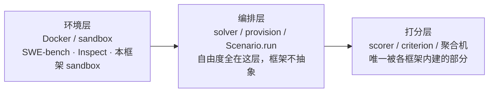

# 混合执行场景承载力调研：skill + 脚本 + CLI + 嵌套依赖 + 安装布局

> 日期：2026-09-19。触发：打分聚合机（[../spec/scoring-aggregation.md](../spec/scoring-aggregation.md)）
> 设计评审时提出的质疑——「实际场景大量是 skill 与脚本（py/mjs）混合执行、skill 驱动 CLI、
> skill 互相依赖嵌套、安装前后目录布局不一，这套机制是否承载得了」。
> 本文以业界公开实践为证据主体；内部实践以角色代称，不暴露具体仓库。

## 结论

**这四类复杂问题没有一类属于「打分出口」，全部归属于执行编排层——聚合机不承担、也不应承担。**
业界同样不存在「统一混合执行抽象」：所有成熟方案都是分层（环境层 / 编排层 / 打分层），
且 skill 之间在规范层**没有依赖机制**。对框架整体的判断：承载面在契约层齐备
（Scenario / provision / sandbox / driver 四个口子），复杂度被刻意留在消费者侧——
这与业界形态一致，也与内部实践「统一执行载体抽象失败」的教训一致。

业界共同形态：

## 业界怎么做

### 1. 混合执行编排：没有统一抽象，全是分层

- **Inspect AI（UK AISI，MIT）**：Task = dataset + solvers + scorers（+ sandbox + limits）。
  solver 是任意 Python（可多轮、可起 agent loop、可调脚本/CLI）；环境隔离交给 sandbox
  （Docker 等，官方有 Sandboxing Toolkit）；打分交给 scorer。**编排自由度完全在 solver 里，
  框架不提供「执行形态」抽象。** 另有 Agent Bridge 接外部 agent 框架。
- **SWE-bench / Terminal-Bench**：任务 = Docker 容器（Dockerfile 锁定初始状态）+
  容器内测试脚本做**终态验证**。harness 不关心 agent 在容器里怎么跑（跑什么脚本、什么 CLI），
  只看最终状态测试。混合执行的复杂度整体下沉进「任务容器 + 验证脚本」。
- **promptfoo**：`exec` / 自定义脚本 provider 承载「被测对象是本机进程」的形态；
  对 agent 轨迹有 `trajectory:tool-used` / `trajectory:tool-sequence` / `skill-used` 等
  内建断言（消费归一化后的 trace）。
- **共同点**：执行形态各写各的，框架层只提供「环境隔离 + 编排入口 + 打分接口」三块。

### 2. skill 驱动 CLI 的权限与边界

- **Agent Skills 规范**：`allowed-tools` frontmatter（实验性）——skill 自己声明预批准工具
  （如 `Bash(git:*)`），由宿主实施放行。这是「skill 声明权限」的业界标准答案。
- **Inspect AI**：tool approval（approver 机制）+ sandbox 边界双重控制；
  工具调用可被审批策略拦截。
- **Terminal-Bench**：权限边界 = 容器边界（agent 在容器内任意跑，出不了容器）。

### 3. skill 依赖与嵌套：规范层无解

- **Agent Skills 规范 frontmatter 全字段**（2026-09 核）：`name`、`description`（必填）；
  `license`、`compatibility`、`metadata`、`allowed-tools`（可选）。**没有依赖声明字段。**
  对 `scripts/` 的要求是「自包含，或用文档写清依赖」——规范把依赖问题推回给作者。
- **Claude Code 插件机制**：多个 skill 打包进一个 plugin 经 marketplace 分发，
  安装后自动发现——**「嵌套」的业界答案是「打包」，不是「依赖声明」**。
  安装作用域分 personal（home 级）与 project（项目级）两层；`name` 必须与目录名一致。
- **结论**：skill 之间没有包管理意义上的依赖解析。任何评测框架都不应假设能
  「解析 skill 依赖图」——被测对象只能是**打包好的安装态整体**。

### 4. 安装前后目录布局：路径相对 skill 根 + 渐进披露

- **Agent Skills 规范**：文件引用一律用**相对 skill 根的路径**（`references/X.md`、
  `scripts/x.py`），且要求引用链保持一层深度；渐进披露三层（metadata → 指令 → 资源）
  决定宿主何时读哪个文件。开发态与安装态的路径一致性靠「相对 skill 根」约定维持，
  不靠环境变量。
- **Claude Code**：安装位置随作用域走（home 级 / 项目级），marketplace 安装落到
  受管插件目录——同一 skill 在不同安装方式下物理路径不同，相对引用是唯一的稳定锚。
- **官方校验**：`skills-ref validate` 做 frontmatter 与命名约定校验。

## 内部实践的教训（角色代称）

- **内部 skill 工具链实践**：曾尝试「统一执行载体抽象」（用一层适配层桥接所有执行形态），
  最终全量下线，重构为「按形态分层」——skill 只作 artifact/frontdoor，
  需要状态、真实执行、批量调度的职责一律下沉脚本/CLI/harness。与业界形态殊途同归。
- 同实践对「skill 无法互相依赖」的工程兜底是 vendoring + 镜像漂移检查（复制 + 校验），
  进一步印证规范层无解。

## 对 x-agent-suite 的归属判断

| 复杂问题 | 业界对应层 | 框架归属层 | 裁决 |
| --- | --- | --- | --- |
| 混合执行编排 | Inspect solver / SWE-bench 容器脚本 | `Scenario.run`（自由编排）+ `ScenarioSpec`（声明式子集） | ✅ 不做统一执行抽象 |
| skill 驱动 CLI 的权限 | `allowed-tools` / approver / 容器边界 | sandbox 隔离 + `HarnessProfile.allowedTools` 白名单 | ✅ 两条路都通 |
| skill 嵌套 / 依赖 | 规范层无解，靠打包 | `provision` 钩子（`unknown`，原样交消费者） | ✅ 保持无机制 |
| 安装态铺设 | 相对 skill 根引用 + 作用域目录 | `provision` + sandbox HOME 重定向 | ✅ 安装语义领域特定，不内建 |
| 打分出口 | promptfoo 样本内加权 / Inspect per-scorer metrics | `Criterion` + `resolveAggregate` | ✅ 本框架唯一该内建的部分 |

## 设计反哺

1. **聚合机文档已补「职责边界」**：`resolveAggregate` 不承载执行编排，
   防止消费者误以为它该管 provision / 脚本步骤 / 安装布局。
2. **「不做统一混合执行抽象」已入决策记录**（capability-system.md）：业界（Inspect/SWE-bench）与
   内部实践双向印证；反转条件 = 某抽象被证明在两个以上领域成立。
3. **provision 是消费者侧真实复杂度所在**：铺安装态（含打包依赖、资源镜像）是评测准备的
   主要工作量；框架给 sandbox 隔离与钩子即可，业界同样止步于此。
4. **主/子决策面分离值得预留**：未来 runner 若支持子载体执行，「编排决策（runner 选择、
   fallback、验证推导）」与「子载体可见输入」需显式分层——内部实践在这点上有未收口的
   剧透风险教训。

## 参考来源

- Agent Skills 规范：<https://agentskills.io/specification>（frontmatter 字段、目录约定、
  渐进披露、相对路径引用、skills-ref 校验）
- Inspect AI：<https://inspect.aisi.org.uk/> 与 scorers 文档（Task 五要素、sandboxing、
  approver、scorer/metric 分层）
- SWE-bench harness：<https://www.swebench.com/SWE-bench/reference/harness/>；
  Terminal-Bench 方法论（Docker 初态 + 容器内终态测试）
- promptfoo 断言文档（exec provider、`trajectory:*` / `skill-used` 断言）
- Claude Code 插件参考：<https://code.claude.com/docs/en/plugins-reference>

## 未验证与遗留

- `allowed-tools` 在各家宿主的实际落地程度不一（规范标注实验性）。
- Inspect 的 approver 与 sandbox 组合在「skill 声明权限」场景下的颗粒度未实测。
- 「评测器自持 agent 循环」这一形态业界无第二例成体系实现，维持「不抽象」裁决的观察期。
