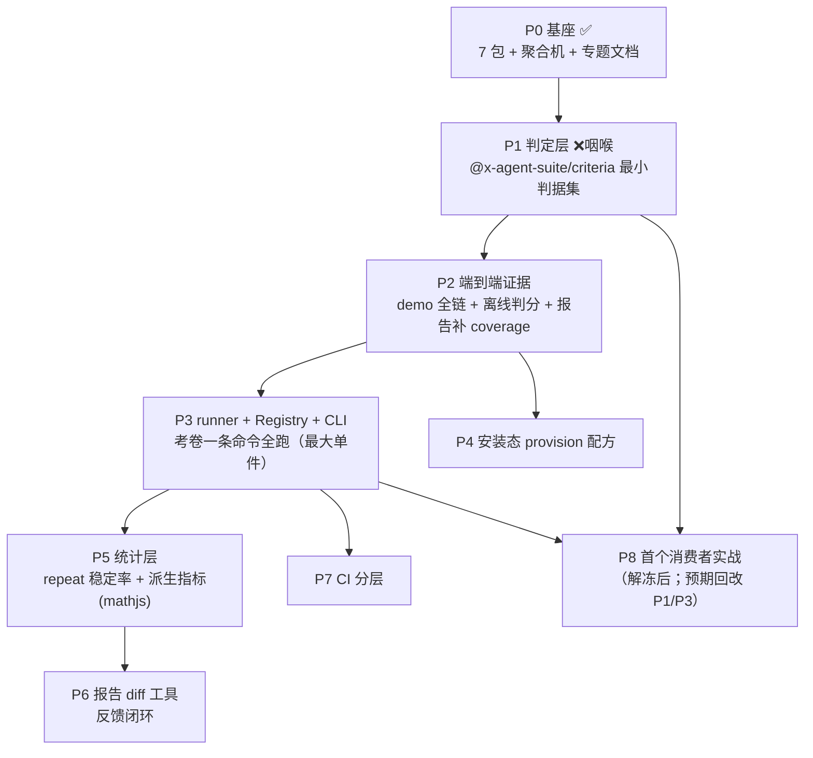

# 能力体系：x-agent-suite 能力账本与路线

> 本文是框架能力的**唯一系统视图**：每个能力件只有三种归宿——**内核 / 一等子包 / 明确不做**。
> 概念可借业界成熟语义（promptfoo / Inspect / Agent Skills），但借的是语义不是 schema；
> 借实现只经正式的子包依赖，不留临时胶水。单件设计细节仍归各专题 spec，本文不重复。

## 定位与北极星

x-agent-suite 是领域中立的 Agent 测试框架：不认识任何被测系统，提供驱动、隔离、观测、
判定、打分、统计、报告的完整能力面，供消费者组装评测闭环。

> **北极星**：给定一个能力包（如 skill）：一条命令跑完全部场景 → 产出分维度、带 coverage
> 的报告 → 改一行提示词重跑，能直接看到哪些维度变好/变坏 → 管道回归默认零 token，
> 真实打分显式烧 key → 全部进 CI。

## 需求侧：能力评测五问

以「判断一个能力包优劣」为典型负载，它要回答五个问题，每个都映射到下方能力件：

| 考题         | 含义                           | 依赖能力件                                         |
| ------------ | ------------------------------ | -------------------------------------------------- |
| 触发对不对   | 该加载时加载、近似场景不误触发 | 场景 DSL、runner、sandbox、确定性判据（GREEN/RED） |
| 规矩守不守   | 加载后是否按规则行事           | 场景 DSL、文本判定、模型裁定                       |
| 活干得好不好 | 真实任务终态对不对             | provision、driver、终态证据、证据核对判据          |
| 边界越不越   | 不越权、不越界、会消歧         | sandbox、RED 反向判据                              |
| 稳不稳贵不贵 | N 次稳定率、token/步数开销     | 统计层、矩阵                                       |

## 能力账本（按层）

状态：✅ 已交付 · ⚠️ 半成品 · ❌ 缺失 · ⛔ 明确不做。

### 场景层

| 能力件                                             | 概念来源                       | 裁决        | 归属            | 状态       |
| -------------------------------------------------- | ------------------------------ | ----------- | --------------- | ---------- |
| 场景声明 DSL                                       | promptfoo tests / Inspect Task | 内核        | `contracts/dsl` | ⚠️ 契约在  |
| 场景 runner + Registry + CLI                       | promptfoo eval / Inspect       | 内核        | P3              | ❌ P3      |
| 考题 authoring 规范（GREEN/RED、钉词表、防免费绿） | 内部评测实践                   | 文档 + 模板 | `docs/`         | ❌ P3 配套 |

### 执行层

| 能力件                                   | 概念来源                              | 裁决                                 | 归属                          | 状态                    |
| ---------------------------------------- | ------------------------------------- | ------------------------------------ | ----------------------------- | ----------------------- |
| 驱动契约（AgentDriver / HarnessProfile） | 本仓原创（强于 promptfoo providers）  | 内核                                 | `contracts/driver`、`harness` | ✅                      |
| 进程/PTY 基座                            | —                                     | 内核                                 | `driver`                      | ✅                      |
| 隔离（HOME/cwd/env 白名单）              | Inspect sandbox / Terminal-Bench 容器 | 内核                                 | `sandbox`                     | ✅                      |
| provision（铺安装态、嵌套依赖、fixture） | SWE-bench 任务容器                    | 钩子在内核、配方在文档               | `contracts/dsl` + `docs/`     | ⚠️ 钩子 ✅ / 配方 ❌ P4 |
| PTY 审批专项（真实 TUI 门槛场景激活）    | —                                     | 内核                                 | `driver` + `harness`          | ⚠️ 驱动在、场景未激活   |
| 统一混合执行抽象                         | —                                     | **不做**（分层承载，见本文决策记录） | —                             | ⛔                      |

### 观测层

| 能力件                                      | 概念来源                             | 裁决                     | 归属                    | 状态 |
| ------------------------------------------- | ------------------------------------ | ------------------------ | ----------------------- | ---- |
| Observation 归一（文本/工具调用/轮数/用量） | Inspect trace / promptfoo trajectory | 内核                     | `contracts/observation` | ✅   |
| 终态证据（ArtifactEvidence）                | 内部评测实践 / Inspect sandbox 检查  | 类型在内核、采集在消费者 | `contracts`             | ⚠️   |
| OTel GenAI 命名对齐                         | OTel 语义约定                        | 缓：仅对齐稳定子集       | 未排期                  | ❌   |

### 判定层（读答案判对错）

| 能力件                                                           | 概念来源                                                 | 裁决         | 归属                      | 状态      |
| ---------------------------------------------------------------- | -------------------------------------------------------- | ------------ | ------------------------- | --------- |
| 确定性判据（contains / not-contains / 工具调用核对；regex 待补） | promptfoo deterministic / Inspect includes·match·pattern | **一等子包** | `@x-agent-suite/criteria` | ✅ P1     |
| 模型裁定判据（rubric judge，grader 借用 live 通道）              | promptfoo llm-rubric / Inspect model_graded_qa           | 子包内可选件 | 同上                      | ❌ 后续批 |
| 失败类别注册（内容失败 vs 环境失败）                             | 内部评测实践 / Inspect scoring policy                    | 内核         | `contracts/criterion`     | ✅        |

### 打分层

| 能力件                                         | 概念来源                        | 裁决                   | 归属                           | 状态       |
| ---------------------------------------------- | ------------------------------- | ---------------------- | ------------------------------ | ---------- |
| 加权聚合机（weight/threshold/knockout/absent） | promptfoo + 自造语义            | 内核                   | `observation/resolveAggregate` | ✅         |
| 离线判分（对已有输出跑判定，不起 agent）       | promptfoo `--model-outputs`     | 内核入口产品化         | `observation`                  | ❌ P2 附带 |
| 自定义打分函数                                 | promptfoo assertScoringFunction | 天然对等（判据即函数） | 已有契约                       | ✅         |

### 统计层（数据集轴）

| 能力件                   | 概念来源                                  | 裁决                              | 归属   | 状态  |
| ------------------------ | ----------------------------------------- | --------------------------------- | ------ | ----- |
| repeat 稳定率 / 成本方差 | promptfoo repeat / Inspect epochs+reducer | 内核                              | 未排期 | ❌ P5 |
| 派生指标（表达式）       | promptfoo derivedMetrics                  | **子包依赖 mathjs**，不自造解析器 | 未排期 | ❌ P5 |

### 报告层

| 能力件                                    | 概念来源               | 裁决                                   | 归属                 | 状态                      |
| ----------------------------------------- | ---------------------- | -------------------------------------- | -------------------- | ------------------------- |
| md/json 报告 + 分维度 + coverage          | promptfoo CLI 报告     | 内核                                   | `observation/report` | ✅（coverage 展示 P2 补） |
| 两版报告维度级 diff（反馈闭环）           | promptfoo side-by-side | 内核极简工具                           | 未排期               | ❌ P6                     |
| 更多输出格式（JUnit / HTML / 自定义模板） | CI 生态惯例            | 内核（按需）                           | `observation/report` | ❌ 未排期                 |
| Web UI                                    | promptfoo web 报告     | **不做**（反转条件：第三个消费者要求） | —                    | ⛔                        |

### 工程层

| 能力件                                        | 概念来源           | 裁决         | 归属          | 状态             |
| --------------------------------------------- | ------------------ | ------------ | ------------- | ---------------- |
| 变体矩阵（场景×模型×carrier）                 | promptfoo 三维矩阵 | 内核         | `matrix`      | ✅               |
| 假端点零 token 回归 / live 借用通道           | 本仓原创           | 内核         | `llm-fixture` | ✅               |
| CI 分层（零 token 默认 / live 显式）          | 本仓测试分层约定   | 流水线配置   | CI            | ⚠️ P7            |
| live 评估转正（nightly 流水线）               | —                  | 工程化       | CI            | ❌ 未排期        |
| fake provider wire 扩展（OpenAI chat 变体等） | —                  | 内核（按需） | `llm-fixture` | ❌ 按需          |
| 架构拆分评估（是否拆独立 repo）               | —                  | 治理决策     | —             | ❌ P3 后评估     |
| release 通道（tarball pin 供下游）            | 消费纪律           | 发版流程     | packaging     | ⚠️ v0.4.0 后未发 |

### 明确不做（全局）

| 能力                                | 理由                                                                                                    |
| ----------------------------------- | ------------------------------------------------------------------------------------------------------- |
| Red teaming / 漏洞扫描 / guardrails | 安全对抗是另一产品域，稀释评测主线                                                                      |
| 几百家 provider 逐一适配            | 本框架走「宿主 CLI + fake/live 双端点」，架构上不需要                                                   |
| skill 依赖解析                      | 业界规范层无解；只评「打包好的安装态整体」                                                              |
| 统一混合执行抽象                    | 分层承载；业界与内部实践双向印证（见 [skill-mixed-execution.md](../research/skill-mixed-execution.md)） |

## 阶段路线（P0–P8）

| 阶段 | 交付物                                                            | 硬性成功标准                                                 |
| ---- | ----------------------------------------------------------------- | ------------------------------------------------------------ |
| P1   | criteria 子包：contains / not-contains / 工具调用核对（judge 缓） | 判据单测绿；喂 mock Observation 真实出 pass/fail；过边界守卫 |
| P2   | examples 全链 demo + 离线判分入口                                 | 跑出真实 md/json 报告且含 coverage                           |
| P3   | Registry + runner + CLI                                           | 声明 3+ 场景，一条命令出全部出口分                           |
| P4   | provision 配方文档 + 参考实现                                     | demo 用安装态能力包跑通                                      |
| P5   | repeat 统计 + 派生指标                                            | 报告含稳定率维度                                             |
| P6   | 报告 diff 工具                                                    | 改一行提示词，对比直接显示维度变化                           |
| P7   | CI 零 token 默认 + live 显式入口                                  | CI 默认零 token                                              |
| P8   | 下游 pin 新 release 接入                                          | 既有基线不退化 + coverage 进报告                             |

**最小可用闭环** = P1 + P2 + P3 + P7简化；P4–P6 是体验增强，可缓（P6 前期用 git diff
顶替、P5 前期手动 repeat 顶替）。

## 决策记录

### 通用化优先，不预设业务语义

- **否决**：在框架内内置任何具体 Agent / CLI / 被测系统的判据或 scenario。
- **理由**：框架的价值建立在领域中立上。第二个消费者会证伪错误抽象。
- **代价**：consumer 需要多写一点注册代码；换来的是框架不随某个宿主漂移。

### 自研 fake provider，不引入外部 mock 库

- **否决**：`@copilotkit/aimock`、`mockttp`；进程内拦截方案结构性排除。
- **理由**：期望响应形态由我们规定，本身就是断言；自研端点可 dump 请求体，可诊断性更高。
- **反转条件**：live 评估转正、prompt 变体组合爆炸、需要真实响应基线时，再引入专业 mock 库。

### 宿主驱动：headless JSONL 为主，PTY 为辅

- **否决**：用 PTY 驱动所有 TUI。
- **理由**：headless 结构化输出有契约，PTY 屏幕断言随界面改版即碎。
- **PTY 唯一不可替代处**：验证交互式审批流本身。

### 混合执行：不提供统一执行抽象

- **否决**：为「skill + 脚本 + CLI」混合场景提供统一的执行载体抽象。
- **理由**：业界成熟方案（Inspect 的 solver、SWE-bench 的容器任务）全是「环境 / 编排 / 打分」分层，编排自由度留在消费者侧；内部 skill 工具链实践的统一载体抽象尝试亦以下线收场。框架只提供 Scenario / provision / sandbox / driver 四个口子。
- **反转条件**：某执行抽象被证明在两个以上消费领域同时成立。
- 依据见 [../research/skill-mixed-execution.md](../research/skill-mixed-execution.md)。

### 入站验证：长驻协议优先于一次性 headless

- **否决**：只用一次性 headless 覆盖全部语义。
- **理由**：入站事件、多轮往返、presence 要求会话存活。
- **代价**：只覆盖协议路径，不覆盖 TUI 路径；需要时用 PTY 补。

## 未决事项

- Registry 的 API 形态（同步 / 异步、文件扫描 / 显式 import）待第一个 consumer 验证。
- CLI 是否需要内置配置文件（如 `x-agent-suite.config.ts`）还是完全通过代码注册。
- 报告输出格式优先级。

## 专题权威索引

单件设计细节不集中重复，权威出处：

- 聚合机自研、命名对齐、judge 不内建：[scoring-aggregation.md](./scoring-aggregation.md)
- 混合执行不抽象、skill 依赖规范层无解：[../research/skill-mixed-execution.md](../research/skill-mixed-execution.md)
- 领域中立与三个合法出口：[boundary-discipline.md](./boundary-discipline.md)
