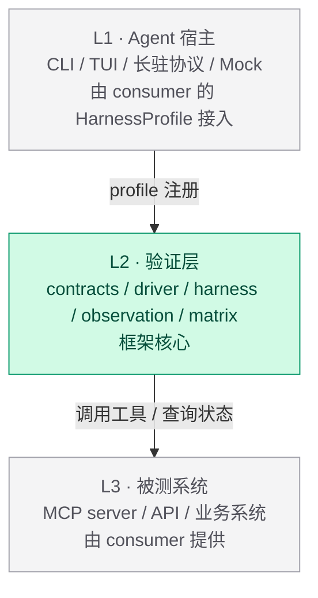

# 分层与依赖选型

> 工具型库用，平台不用；失效方式是假阴/假阳性，不是报错。

## 选型原则：工具型库 vs 平台

判断一个依赖属于哪类，要过**两条**测试。两条都过才算工具型库。

**测试一 · 调用形态** —— 能不能 `import` 一个函数就用上？

**测试二 · 依赖形态** —— 它有没有把自己的外部 I/O 和领域约定带进来？（网络客户端、prompt 模板、配置格式、设计系统、自己的 TUI）**有 → 它是某个客户端或平台的一块，不是工具。**

|              | 工具型库             | 平台                                   |
| ------------ | -------------------- | -------------------------------------- |
| 用法         | import 一个函数 / 类 | 写配置文件 + 走它的 CLI 入口           |
| 对项目的要求 | 无                   | 目录约定、生命周期、报告格式全按它的来 |
| 换掉的成本   | 改几行 import        | 重写项目结构                           |
| 决策         | **用**               | **不用**                               |

平台不是质量问题，是**契合度**问题：它把编排、判据、报告、CI 打成一个包卖给你，而 x-agent-suite 需要的只是其中一两件。为了那一两件接受整套项目结构，代价远大于自建。

**为什么要第二条测试。** 只有测试一时，`autoevals` 会过关——`import { Factuality } from 'autoevals'` 确实一行就能用——但它拖进 `openai` 客户端、mustache prompt 模板、zod-to-json-schema，实际是「一半纯函数打分器、一半内置 OpenAI 客户端的 judge 框架」。

## x-agent-suite 的三层

**依赖方向：L2 只向下依赖通用基座，不向上依赖任何被测系统或宿主实现。**

| 层  | 框架提供                                               | consumer 提供                       |
| --- | ------------------------------------------------------ | ----------------------------------- |
| L3  | —                                                      | 被测系统                            |
| L2  | driver 基座、profile 协议、Observation 归一、评分/报告 | HarnessProfile、scenario、criterion |
| L1  | —                                                      | 具体 CLI 适配                       |

## 一条贯穿各层的观察

**Agent 测试工具的失效方式是假阴性和假阳性，不是报错。**

| 出处                                               | 失效形态                                              |
| -------------------------------------------------- | ----------------------------------------------------- |
| [driver.md](./driver.md)                           | screen 文本被用来断言 → TUI 改版即碎                  |
| [scenario-evaluation.md](./scenario-evaluation.md) | `expect` 键 typo → 该轮不跑任何判据，场景变绿         |
| [long-lived-driver.md](./long-lived-driver.md)     | 把宿主通知流当证据，而非被测系统侧记录                |
| [matrix.md](./matrix.md)                           | 单个 carrier 失败被当整体失败，或单个成功被当整体通过 |

这些都不会抛异常，都会以「测试通过」或「测试失败」的正常形态呈现。

**凡是新增机制，先问它出错时会不会安静地给出一个可信的错答案。**
