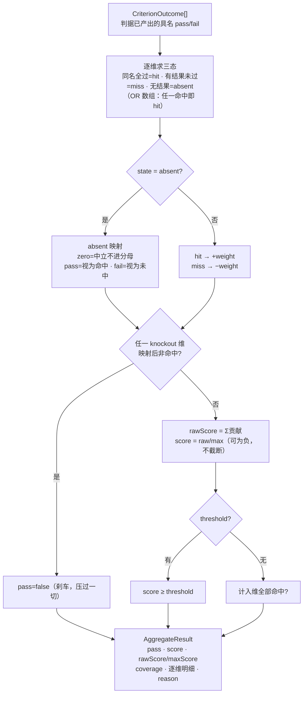

# 打分聚合机：静态打分出口

> 判据负责判定，聚合机负责算分。AI 只产具名裁定，分数恒由静态机出口。

## 目的

在框架内建一个**领域中立的打分聚合机**：把若干判据的具名判定结果（`CriterionOutcome`）按声明好的维度规则聚合成一个出口分。它回答的问题：「一组判定结果，怎么变成一个可分、可比、可审计的总分？」

## 背景

- 分层评分（Dry / Hard / Fuzzy / judge）已有每层怎么判的设计（见 [scenario-evaluation.md](./scenario-evaluation.md)），但**层与判据之间如何汇总成一个分**一直缺失——`CriterionResult` 止步于单判据 `{pass, score 0..1, reason}`，`ScenarioResult` 只有布尔层。
- 业界对照（2026 年调研）：promptfoo 的 `weight` / `threshold` / `metric` 是最广为人知的聚合语义；「刹车否决」「缺席三态」「负分惩罚臆答」在业界无声明式对应物，promptfoo 也只能用自定义打分函数兜底。
- 打分出口是评测框架的信任根基：第三方包演进改变打分语义 = 历史报告全部失去可比性。因此聚合机**自研、零依赖**（决策记录见末节），与本仓「自研 fake provider」决策同构。

## 业界调研：聚合打分怎么做的

| 方案 | 聚合模型 | 对本设计的意义 |
| --- | --- | --- |
| promptfoo | **样本内声明式加权**：断言带 `weight` / `metric`，样本分 = 加权平均，`threshold` 判 pass；`derivedMetrics` + 自定义 `assertScoringFunction`（JS/Python）兜底复杂逻辑 | 唯一成体系的样本内加权语义；`weight`/`threshold`/`metric` 命名与缺省 `weight=1` 沿用之 |
| Inspect AI（UK AISI） | **另一条聚合轴**：每个 scorer 自带 metrics，聚合方向是「样本 → 数据集」统计（`accuracy()` / `mean()` / `stderr()`）+ epochs reducer（mean/median/max/at_least）；scoring policy 显式处理 unscored / error 对 coverage 的影响 | coverage 披露语义业界有先例；数据集级统计聚合明确**不归**本设计，留给报告层 |
| autoevals（Braintrust） | 独立 scorer 库（judge / 启发式 / 统计），无聚合机 | 证实「判据可抽包、聚合机无人抽包」 |
| DeepEval / RAGAS | 逐 metric 独立出分，无声明式样本内加权 | 加权聚合非普遍标配，但 promptfoo 证明其有真实需求面 |

关键判断：**knockout（刹车否决）与 absent（缺席三态）在业界无声明式对应物**——promptfoo 也只能用自定义打分函数（代码）兜底。自造有理，但命名保持直白。两种聚合轴正交：本设计取「场景内跨判据加权」轴，「跨场景数据集统计」轴属于报告层职责，不在此设计。

## 边界自查（先于设计）

| 检查项 | 结论 |
| --- | --- |
| 是否引入具体判据名 / 宿主名 / 协议标记 | 否。词表仅 `metric / weight / threshold / knockout / absent / dimension`，过 `pnpm boundary` |
| 第二个消费者是否需要 | 是。加权聚合是 promptfoo / DeepEval / RAGAS 共有的跨领域需求，非单一消费者定制 |
| 是否破坏「零内建判据」 | 否。聚合机不判定任何事，只消费判据已产出的具名结果做算术 |
| 是否扩展 `ScenarioSpec` 契约 | 否。聚合声明的载体由消费者持有（见「接线位置」） |
| 可比性轴（[scenario-dsl.md](./scenario-dsl.md)） | 不引入主动分支；LLM 仍只当分类器不当控制器——聚合规则是一张静态表 |

## 核心概念

```text
CriterionOutcome[]            （判据已产出，具名、带 pass/score/reason）
        │
        ▼  按维度声明引用（metric 名）
DimensionOutcome[]            （每维：命中 / 未命中 / 缺席 → 三态映射 → ±weight）
        │
        ▼  knockout 短路优先于累加
AggregateResult               （出口：pass + 归一分 + 原始分 + coverage + 明细）
```

三个不变量：

1. **knockout 是刹车**：装了 `knockout` 的维度非命中，整体直接 FAIL，压过一切累加。
2. **缺席要显式**：判据未评估（未运行、环境失败、前提不成立）不等于答错，按该维 `absent` 映射处理，且必须计入 coverage 披露。
3. **coverage 强制披露**：不同 coverage 的聚合分不可比，报告必须带 `(evaluated/total)`。

判定流水线（实现即此序）：



### 算例

```text
dimensions:
  routing:  { weight: 2, knockout: true }   → 判据 pass   → +2  hit
  content:  { weight: 2 }                    → 判据 fail   → −2  miss
  style:    { weight: 1 }                    → 无结果      →  0  absent(zero)

rawScore = 0, maxScore = 4, score = 0, coverage = 2/3
threshold = 0.5 → pass = false
reason: 未通过；coverage 2/3；无判据结果的引用：style
```

若 `routing` 为 miss：即使 `content` 满分，knockout 也会直接判 `pass=false`，累加结果无效。

## 类型设计

```ts
/** 维度声明：把一个具名判据结果接入聚合机。 */
export interface DimensionSpec {
  /**
   * 引用的判据名（对应 CriterionOutcome.name）。
   * 数组形态表示 OR：任一引用命中即本维命中。
   */
  readonly metric: string | readonly string[];
  /** 权重：命中 +weight / 未命中 −weight。缺省 1。 */
  readonly weight?: number;
  /** true 时本维非命中（含按 absent 映射为 fail）→ 整体 FAIL。缺省 false。 */
  readonly knockout?: boolean;
  /** 缺席映射：zero=在场零出力 / pass=视为命中 / fail=视为未命中。缺省 "zero"。 */
  readonly absent?: "zero" | "pass" | "fail";
}

/** 聚合声明：一张静态表。 */
export interface AggregationSpec {
  readonly dimensions: readonly DimensionSpec[];
  /** 过线阈值，作用于归一分（0..1）。省略时：全部在场维命中且无 knockout 触发才 pass。 */
  readonly threshold?: number;
}

/** 单维结果。 */
export interface DimensionOutcome {
  readonly metric: string | readonly string[];
  /** 三态：hit / miss / absent（absent 为映射前的原始状态）。 */
  readonly state: "hit" | "miss" | "absent";
  /** 本维对原始分的贡献（±weight 或 0）。 */
  readonly contribution: number;
  readonly reason: string;
}

/** 聚合出口。 */
export interface AggregateResult {
  readonly pass: boolean;
  /** 归一分：rawScore / maxScore，可为负；原样展示，不截断。 */
  readonly score: number;
  /** 原始累加分（不封顶，可为负）。 */
  readonly rawScore: number;
  /** 在场维（含 absent 映射为 pass/fail 者）权重和；全缺席时为 0，score 记 0。 */
  readonly maxScore: number;
  /** 覆盖披露：evaluated = 非缺席维数，total = 声明维数。 */
  readonly coverage: { readonly evaluated: number; readonly total: number };
  readonly dimensions: readonly DimensionOutcome[];
  readonly reason: string;
}

/** 聚合机：纯函数，零依赖，同步。 */
export declare function resolveAggregate(
  outcomes: readonly CriterionOutcome[],
  spec: AggregationSpec,
): AggregateResult;
```

语义细节（实现级口径，代码以此为准）：

- **维度状态（映射前）**：该 `metric` 名下有判定结果且**全部** `pass=true` → hit；有结果但至少一个 `pass=false` → miss；名下无任何结果 → absent。同名多结果（turn 判据每轮一条）取严格口径「全过才算命中」，与 hard 门禁哲学一致。
- **metric 数组（OR）**：任一引用 metric 为 hit → 本维 hit；引用都有结果但无一 hit → miss；引用全部无结果 → absent。
- **absent 映射**：`zero` → 贡献 0、**不计入** maxScore（中立，靠 coverage 披露）；`pass` → 视为 hit、计入 maxScore；`fail` → 视为 miss、计入 maxScore。
- **maxScore**：计入维（hit / miss / absent→pass / absent→fail）的 weight 总和；全部维度 absent→zero 或无维度时 `maxScore = 0`，`score` 记 0。
- **负分是刻意的**：未命中 `−weight` 惩罚臆答/乱答（「不答」经 `absent: zero` 反而中立），防止「蒙一个总比不答划算」。这是与 promptfoo（miss 计 0）的有意分歧。归一分 `score = rawScore / maxScore` 不截断到 `[0,1]`，负分原样进报告——「比零分还差」是有信息量的。报告 reason 必须体现每维贡献。
- **判定顺序**：knockout 短路 → 累加 → threshold / 缺省 pass 判定。任一 `knockout` 维**映射后**非 hit（含 absent→zero / absent→fail）→ `pass=false`，压过累加与 threshold。环境失败应在上游判据层被拦（不产出结果、走 `FailureCategory`），到达聚合机的 absent 只是数据。
- **pass 判定**：knockout 未触发，且 `threshold` 存在时 `score >= threshold`；省略时计入维全部 hit。
- **空考警示**：`coverage.evaluated = 0`（无任何在场维）时 reason 必须显式声明「无在场维度」——机制上不替场景做 zero/fail 选择，但绝不允许「免费绿」被静默误读。
- **coverage**：`evaluated` = 映射前非缺席维数，`total` = 声明维数。
- **引用完整性**：`metric` 引用了任何判据都未产出的名字时，按 absent 处理（不报错），但 `resolveAggregate` 在 reason 中逐个点名，供场景作者发现拼写错误（呼应 [scenario-dsl.md](./scenario-dsl.md) 的引用完整性校验原则）。

## 接线位置

聚合机在主链中的位置（唯一的内建打分件，执行编排不归它）：

```text
provision（铺安装态，消费者写）
  → driver / sandbox（跑场景，框架给）
    → Observation → Criterion[]（判据，消费者注册）
      → resolveAggregate（本件，框架内建）→ ScenarioResult → 报告
```

- **类型**：`@x-agent-suite/contracts`（与本包「只导出类型」一致，上述接口均为类型声明）。
- **实现**：`@x-agent-suite/observation` 新增 `resolveAggregate` 纯函数——该包已是「判据结果 → 报告」的汇聚点。
- **spec 载体**：当前框架无通用 runner（P3 未交付），聚合声明由消费者放在自己的场景文件 / `metadata` 自由区，调用 `resolveAggregate` 后把 `AggregateResult` 塞进 `ScenarioResult.evidence` 进报告。runner 落地时再定官方载体，本设计不预设。

## judge 接入面（不内建 judge）

- judge 是**消费者判据**：它调用模型产出具名布尔裁定（`pass`/`fail`），以普通 `CriterionOutcome` 进入聚合机。框架自始至终不认识 judge——「AI 只产具名裁定，分数恒由静态机出口」在框架层自然成立。
- **grader 渠道复用 live 基建（借用载体，不自建 AI）**：judge 判据的模型调用复用 `@x-agent-suite/llm-fixture` 的 live 渠道机制——`~/.env.e2e.yaml` 等五级配置加载、`E2E_LIVE_*` 覆盖、`borrowCredential` 借用宿主登录态、缺配置显式「未配置」不抛异常、`redactLiveSecrets` 脱敏。缺省与被测同渠道，需要异渠道裁判时按 carrier 名另配。judge 调用属 token 消耗，只能在 `*.token.ittest.ts` 层显式运行。
- **失败分层**：grader 未配置 / 调用失败 / 回答不可解析 = 环境失败，对应判据不产出结果 → 该维按 absent 处理并进 coverage，不压分（沿用 `FailureCategory` 的 `owner: kit|domain` 区分）。

## 依赖决策记录

| 决策 | 结论 | 理由 | 反转条件 |
| --- | --- | --- | --- |
| 聚合机自研，不引 promptfoo 本体 | ✅ | 聚合未从 promptfoo 抽成独立模块；引入整个评测产品换约 100 行算术，语义还随其版本漂移 | 业界出现独立、稳定、语义等价的聚合规范包 |
| 不引 autoevals 进内核 | ✅ | 它是判据库（judge 侧），进内核违反「零内建判据」 | 仅可在可选判据子包以可选依赖接入 |
| 表达式派生指标需要时引 mathjs | 暂缓 | 当前声明式维度已够用（YAGNI）；mathjs 是 promptfoo derivedMetrics 的同款选型 | 消费者提出公式型派生指标需求 |
| 命名对齐 promptfoo：`weight` / `threshold` / `metric` | ✅ | 业界最广为人知的聚合语义，降低学习成本 | — |
| `knockout` / `absent` 自造 | ✅ | 业界无声明式对应物，命名直白即可 | 业界出现对应标准词汇 |

## 落地决策记录

| 日期 | 决策 | 理由 |
| --- | --- | --- |
| 2026-09-19 | 第二个消费者坐实：内部宿主评估实践（多条确定性判据 + 分维度稳定率场景） | 边界自查「第二个消费者是否需要」从论证变为实证；其既有分维度指标需靠闭包 hack 实现、「未触达即空置通过」的假绿问题正是本机制的对症场景 |
| 2026-09-19 | 落地顺序：基座先行实现，消费者侧接入另行排期 | 消费者 pin 的基座版本尚无本机制，先产基座能力与新 release |
| 2026-09-19 | **`weight` 缺省 = 1**（从「未决事项」结案） | 权重是精调手段而非必填门槛：不熟悉打分配置的人一个数字都不写，也应得到合理打分（缺省表：weight=1、无 knockout、absent=zero） |
| 2026-09-19 | 「免费绿」的缺席语义（zero / fail 选型）归消费者场景侧 | 机制三种映射全支持；选哪个是被测领域的语义判断，框架不替场景拍板 |

## 验收标准

- 单元测试覆盖：三态映射、knockout 短路优先于累加、负分不截断、`maxScore=0` 全缺席、coverage 计算、threshold 边界（含缺省 pass 规则）、metric 数组 OR、未知名引用的 reason 点名。
- `pnpm boundary` 无新增违规；`pnpm check` 全绿。
- 本文件与 `contracts.md` / `scenario-evaluation.md` 交叉引用同步。

## 未决事项

- `AggregateResult` 是否需要在 runner 落地后升级为 `ScenarioResult` 的一等字段。
- 观测字段命名向 OTel GenAI `gen_ai.*` 靠拢：另开任务，仅对齐稳定子集（token / tool 命名），不属于本设计范围。
