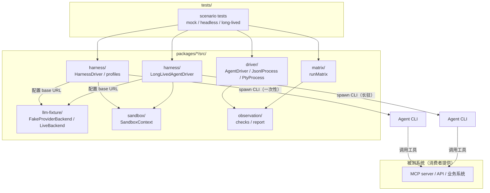

# x-agent-suite 框架总览

> 目标：在不消耗真实 API token 的前提下，验证 Agent 宿主能否正确加载并调用被测系统；同时保留一套可扩展的 driver 接口，供不同宿主接入。

## 目录

| 文档                                               | 内容                                                         |
| -------------------------------------------------- | ------------------------------------------------------------ |
| [contracts.md](./contracts.md)                     | 通用契约：Observation、Driver、Scenario、Criterion、Registry |
| [boundary-discipline.md](./boundary-discipline.md) | 边界纪律：四条守卫、三个合法出口、边界债务                   |
| [layering.md](./layering.md)                       | 分层与依赖选型：工具型库 vs 平台                             |
| [scenario-dsl.md](./scenario-dsl.md)               | Scenario DSL 设计原则                                        |
| [driver.md](./driver.md)                           | 子进程 / JSONL / PTY 基座 + 宿主适配纪律                     |
| [packaging.md](./packaging.md)                     | 包分发与原生依赖分层                                         |
| [sandbox.md](./sandbox.md)                         | 无 Docker 隔离环境                                           |
| [llm-fixture.md](./llm-fixture.md)                 | 自研 fake provider + harness profile                         |
| [scenario-evaluation.md](./scenario-evaluation.md) | 完整 scenario + 评分层                                       |
| [matrix.md](./matrix.md)                           | Matrix 脚本：同 scenario 多宿主对照表                        |
| [long-lived-driver.md](./long-lived-driver.md)     | 长驻会话 driver：入站事件观测                                |
| [pty-driver.md](./pty-driver.md)                   | PTY 驱动层                                                   |
| [lessons-from-evals.md](./lessons-from-evals.md)   | 从评测实践借鉴的模式                                         |

## 结论

x-agent-suite 把验证拆成三层：

1. **内存/进程内 driver**：纯内存或单进程实现，默认跑 `pnpm test`，零副作用、零成本。
2. **一次性 headless driver**：为提供非交互 JSONL/流式输出的 CLI 定义 profile，用**自研 fake provider**（`node:http`）提供确定性 LLM 响应；零 token 走通。
3. **长驻 driver**：为提供长驻双向通道的 CLI 定义 driver，在同一 session 上多轮注入并观测入站事件。

驱动方式以**结构化协议 IO** 为主（长驻走 JSON-RPC / JSONL，一次性走官方 JSONL 输出）。PTY 仅作补充层，只覆盖 TUI 交互路径，见 [pty-driver.md](./pty-driver.md)。

## 总体架构



## 组件总览

| 组件          | 包                           | 职责                                                          | 入口文件                     |
| ------------- | ---------------------------- | ------------------------------------------------------------- | ---------------------------- |
| `driver`      | `@x-agent-suite/driver`      | harness 无关的 `AgentDriver` 接口与 `JsonlProcess` 子进程基座 | `packages/driver/src/*`      |
| `sandbox`     | `@x-agent-suite/sandbox`     | 临时 `HOME`/`cwd`、清理                                       | `packages/sandbox/src/*`     |
| `llm-fixture` | `@x-agent-suite/llm-fixture` | LLM backend 抽象与自研 fake provider                          | `packages/llm-fixture/src/*` |
| `harness`     | `@x-agent-suite/harness`     | Agent CLI 的 profile 与 driver 抽象                           | `packages/harness/src/*`     |
| `observation` | `@x-agent-suite/observation` | 统一 Observation / checks / 评分层                            | `packages/observation/src/*` |
| `matrix`      | `@x-agent-suite/matrix`      | 同场景多宿主对照表                                            | `packages/matrix/src/*`      |
| `contracts`   | `@x-agent-suite/contracts`   | 框架与 consumer 之间的全部类型契约                            | `packages/contracts/src/*`   |

## 两种运行模式

| 模式      | 启动方式                    | LLM                | 副作用         | 用途                    |
| --------- | --------------------------- | ------------------ | -------------- | ----------------------- |
| `fixture` | 默认                        | 自研 fake provider | 无             | 回归测试                |
| `live`    | `E2E_LLM_MODE=live`（可选） | 真实 API           | 每次消耗 token | 评估模型 tool call 质量 |

## 环境变量

| 变量                   | 含义                                                                                | 默认值    |
| ---------------------- | ----------------------------------------------------------------------------------- | --------- |
| `E2E_LLM_MODE`         | `fixture` / `live`                                                                  | `fixture` |
| `E2E_FAKE_DUMP_DIR`    | 假端点请求体落盘目录（诊断用）                                                      | 不落盘    |
| `E2E_LIVE_CONFIG_PATH` | live 私密配置区显式文件路径（优先级最高）                                           | -         |
| `E2E_LIVE_<CARRIER>_*` | live 渠道字段级 env 覆盖：`BASE_URL` / `MODEL` / `API_KEY` / `API_KEY_ENV` / `WIRE` | -         |
| `E2E_KEEP_SANDBOX`     | 测试失败后是否保留临时目录用于诊断                                                  | `0`       |

### live 私密配置区

live 模式的渠道/模型声明放私密配置区，配置文件为 **YAML**（支持注释），按 carrier 声明：

```yaml
# .env.e2e.yaml（repo 根；被 .gitignore 的 .env* 规则覆盖，切勿提交）
carriers:
  codex-like:
    from: harness # 借用宿主 CLI 自己的配置
  custom-relay:
    wire: openai-chat # openai-responses / openai-chat / anthropic-messages / gemini-generate
    baseUrl: https://host/v1 # 含版本前缀
    model: some-model
    apiKeyEnv: MY_API_KEY # 或 apiKey 字面量
```

`from: harness` 表示借用宿主 CLI 登录态；显式字段覆盖借用值。只写 `from: harness` 的裸声明（省 wire/baseUrl/model）语义为整体使用宿主默认渠道（读宿主 settings 的默认 provider/model；宿主内置 provider 由框架内置表兜底）。多 provider 宿主可声明 `provider` 选择借用目标（此时须显式声明 `model`，除非借用目标恰为宿主默认 provider）。借用目标在宿主配置与内置表中均不存在、自定义条目缺 `baseUrl`、或选了非默认 provider 却不声明 `model`，均为显式 missing/invalid，不回退宿主默认渠道。token 过期或缺失 → 显式 missing，不抛异常。

加载顺序：env 字段覆盖 > `E2E_LIVE_CONFIG_PATH` 显式文件 > repo 内 `.env.e2e.yaml` > `~/.env.e2e.yaml`（home 级，跨仓库共享）> `~/.config/x-agent-suite/.env.e2e.yaml`（历史路径）。缺文件/缺 carrier 时 live 用例按「未配置」skip，不判红。

## 验收标准

- `pnpm test` 默认全部零成本通过。
- 至少一个真实 headless 宿主在 fixture 模式下通过 preflight，断言基于结构化 `status` 而非退出码；不得全 skip 即视为通过。
- 长驻宿主能在单会话完成多轮注入并产出 `InboundEvent`；至少一端真实执行并断言。
- 设计文档与架构图同步更新。
